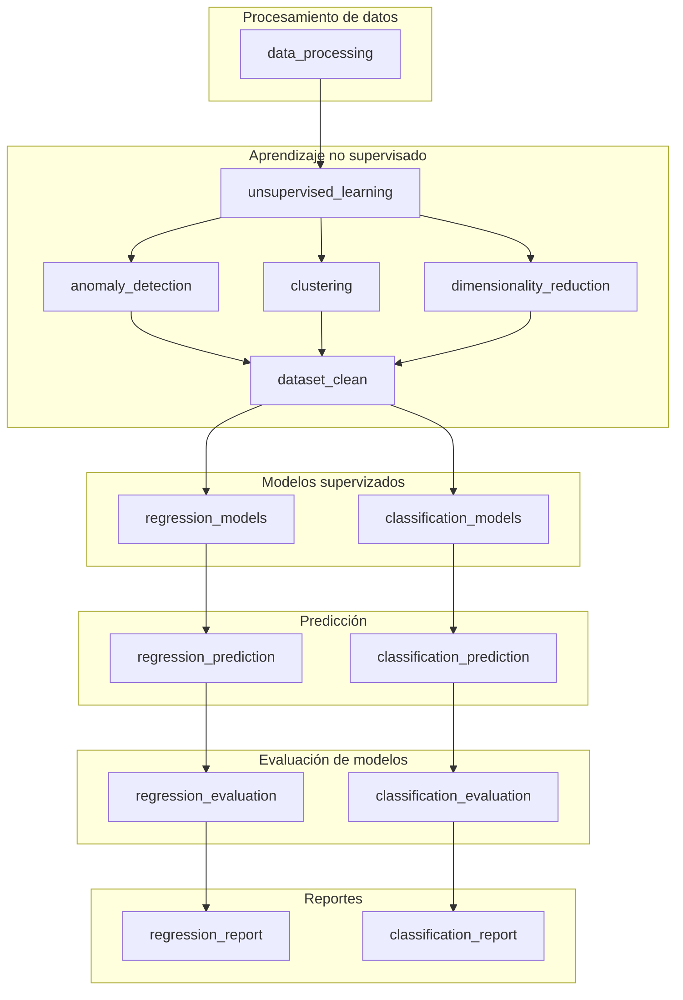

# *Proyecto de análisis de Jugadores FIFA 20-23*

[](https://www.python.org/)
[](https://kedro.org/)
[](#)


**Colaboradores:** Benjamin Andres Oviedo y Brandon. 

**Docente:** Giocrisrai Godoy Bonillo.

## Introducción 

### Descripción del caso *

*[EA Sports FIFA](https://www.ea.com/es-es/games)*, es una saga de videojuegos de fútbol publicada anualmente por *Electronic Arts* bajo el sello de **EA Sports**, en colaboración con la **FIFA**.

### Necesidad del negocio

La empresa busca **replicar la experiencia del fútbol real**, tanto en la gestión de equipos como en la competencia dentro del campo, ofreciendo realismo gracias a sus licencias oficiales de equipos, jugadores y ligas de todo el mundo. Con la reciente transición a EA Sports FC, el objetivo principal sigue siendo simular el deporte del fútbol y permitir a los jugadores disputar partidos o gestionar un club en diversos modos de juego.

##  Datos obtenidos

El dataset (conjunto de datos) obtenidos para el proyecto es proveniente de [kaggle](https://www.kaggle.com/) en la que se obtuvieron los datasets de FIFA20 hasta FIFA23. En este proyecto se descartaron el uso de los datos de años anteriores al FIFA20.

### Acerca de los datos

Contiene más de 17.000 registros con atributos demográficos, características físicas, estadísticas de juego, detalles contractuales y afiliaciones a clubes.

**Kaggle-FIFA:** [Link](https://www.kaggle.com/datasets/bryanb/fifa-player-stats-database?rvi=1)	

## Objetivos

### Objetivo del proyecto

El objetivo principal del proyecto es desarrollar e integrar en un sistema funcionalidades basadas en modelos de predicción, aplicando técnicas de machine learning, con el fin de generar análisis y predicciones automáticas sobre el desempeño de los jugadores de FIFA en función de sus características, **contribuyendo a la simulación del fútbol real y al modelado del rendimiento de los jugadores en distintos escenarios de juego**, alineándose con la necesidad de la empresa de ofrecer una experiencia realista y basada en datos.

### Objetivos de Machine Learning *

**Aprendizaje semisupervisado** *

Mejorar los modelos de supervizados utiliando aprendizaje no supervizado para obtener resultados mas preciso para el negocio..


---
<!-- TEXTO README hecho por el colaborador
     
     El texto visualizado en el repositorio fue simplicado por CHATGPT 

"""

## Metodologia CRISP-DM **

La metodología CRISP-DM es un modelo de proceso estandarizado para llevar a cabo proyectos de minería de datos y, por extensión, de machine learning. Fue desarrollada a finales de la década de 1990 por un consorcio de empresas como SPSS, Daimler AG y NCR. Su objetivo principal es proporcionar una guía **flexible** y no propietaria que sea aplicable a una amplia variedad de industrias y problemas.

> CRISP-DM es ideal para Proyectos de Data Science e IA: Modelado de predicción, detección de anomalías y sistemas de recomendación.


### Fases de CRISP-DM

Se aplican las 6 fases de La metodologia CRISP-DM. A continuación, se presenta un breve resumen de cada fases del proyecto y las tareas realizadas en cada una:

- **la comprension del negocio:** 
Se orienta a indetificar y entender las necesidades del cliente. En esta fase definimos los objetivos del proyecto y se evalua la situación desde distintos puntos de vista, tanto del contexto empresarial como de  los recursos monetarios asignados. Asi mismo se analizan los riesgos, alcances y costos asociados.

- **Comprension de datos:** 
En esta fase, estudiamos en detalle los datos obtenidos. La comprensión de datos implicando acceder a ellos y explorarlos mediante tablas y gráficos. En esta etapa se realizan tareas como la recopilación de datos, la descripción de los resultados, la identificación de anomalías, la exploración inicial y la verificación de la calidad de los datos.

- **Modelado:** 
Luego de la comprención de los datos, se utilizó **kedro** para realizar una limpieza de datos automatizada. Posteriormente, se seleccionaron las técnicas de modelos mas adecuados. En este proyecto se realizaron:

-  Modelos supervizados de regresión.

- Modelos supervizados de clasificación.

- Modelos no supervizados. 

---

- **Evaluación:**
Esta etapa se centra en la **evaluacion tecnica de los modelos**, considerando diferentes tipos de aspectos de desempeño y alineado con los objetivos del negocio 

- **Evaluación de resultados:** Modelos que cumplan con los criterios de exito empresarial utilizando métricas de desempeño aceptables como R², F1-Score, entre otras.

- **Proceso de revisión:** Se revisan los parámetros aplicados, los pasos ejecutados durante el modelado y los hallazgos obtenidos, así como posibles errores o anomalías identificadas.

- **Despliegue:** 
Etapa final en la que se ponen a prueba los resultados obtenidos. En esta fase se realiza un entregable funcional, en el cual se ponen en uso los modelos desarrollados o las funciones basadas en dichos modelos, permitiendo su aplicación en un entorno real o de prueba Y da por finalizado las etapas de CRISP-DM 

> Dependiendo de las necesidades de la organización es posible una o mas fases.

En general, la fase de despliegue de CRISP-DM incluye dos tipos de actividades:

- Planificación y control del despliegue de los resultados

- Finalización de tareas de presentación como la producción de un informe final y la revisión de un proyecto

-->

# Metodología CRISP-DM

La metodología **CRISP-DM** (*Cross-Industry Standard Process for Data Mining*) es un modelo estandarizado para proyectos de **minería de datos** y **machine learning**.  
Fue desarrollada a finales de los años 90 por empresas como **SPSS, Daimler AG y NCR**, y proporciona una guía **flexible y no propietaria**, aplicable a diferentes industrias y tipos de problemas.

> **CRISP-DM es ideal para proyectos de Data Science e Inteligencia Artificial**  
> - Modelado de predicción  
> - Detección de anomalías  
> - Sistemas de recomendación

---

### Fases de CRISP-DM

Se aplican las seis fases de CRISP-DM. A continuación se detallan cada fase y las tareas realizadas:

---

### 1. Comprensión del negocio
- **Objetivo:** Identificar y entender las necesidades del cliente.  
- **Tareas principales:**  
  - Definir los objetivos del proyecto  
  - Evaluar el contexto empresarial y los recursos asignados  
  - Analizar riesgos, alcances y costos

---

### 2. Comprensión de los datos
- **Objetivo:** Estudiar los datos en detalle y explorarlos mediante tablas y gráficos.  
- **Tareas principales:**  
  - Recopilación de datos  
  - Descripción de resultados  
  - Identificación de anomalías  
  - Exploración inicial  
  - Verificación de la calidad de los datos

---

### 3. Modelado
- **Objetivo:** Construir modelos que respondan a los objetivos del proyecto.  
- **Herramienta utilizada:** **Kedro** (para limpieza automatizada de datos)  
- **Modelos desarrollados:**  
  - Supervisados de **regresión**  
  - Supervisados de **clasificación**  
  - **No supervisados**

---

### 4. Evaluación
- **Objetivo:** Evaluar el desempeño técnico de los modelos y su alineación con los objetivos de negocio.  
- **Evaluación de resultados:**  
  - Modelos que cumplan con criterios de éxito empresarial  
  - Métricas utilizadas: **R²**, **F1-Score**, entre otras  
- **Proceso de revisión:**  
  - Revisión de parámetros aplicados  
  - Pasos ejecutados durante el modelado  
  - Hallazgos, errores o anomalías detectadas

---

### 5. Despliegue

- **Objetivo:** Poner a prueba y entregar los modelos de manera funcional.  
- **Actividades principales:**  
  - Planificación y control del despliegue de resultados  
  - Elaboración de informe final y revisión del proyecto  
- **Notas:**  
  - Permite la aplicación de modelos o funciones en entornos reales o de prueba  
  - Esta fase finaliza el ciclo de CRISP-DM, aunque según las necesidades, puede ser necesario repetir alguna fase

---

**Notebooks**

- [Business Understanding](notebooks/01_Business_Understanding.ipynb)
- [Data Understanding](notebooks/02_Data_Understanding.ipynb)
- [Data Preparation](notebooks/03_Data_Preparation.ipynb)
- [Modeling](notebooks/04_Modeling.ipynb)
- [Final analysis](notebooks/06_final_analysis.ipynb)

## Repositorios 

- [DockerHub](https://hub.docker.com/repository/docker/brandonlcc/fifa_ml_kedro/general)

- [DVC con Dagshub](https://dagshub.com/br.casas/ML-Kedro-FIFA-DVC)

- [Deployment FIFA](https://github.com/BrandonLCC/FIFA-web)

---

## Estructura del proyecto

```
Proyecto_ML_Kedro/
│
├── .dvc/
│
├── airflow/
│   ├── dags/
│   ├── logs/
│   └── plugins/
│
├── conf/
│   ├── base/
│   │   ├── parameters.yml    # Configuración de parámetros
│   │   └── catalog.yml       # Catalog de datasets
│   └── local/
│
├── data/
│   ├── 01_raw/
│   ├── 02_intermediate/      # Datos preprocesados
│   ├── 03_primary/      
│   ├── 04_feature/           # Features generadas con unsupervised
│   ├── 05_model_input/       # Datasets para entrenamiento y test
│   ├── 06_models/            # Modelos entrenados (Pickle)
│   ├── 07_model_output/      # Predicciónes 
│   └── 08_reporting/         # Reportes de métricas
│
├── docker/
│   ├── Dockerfile
│   ├── docker-compose.yml
│   └── requirements.txt
|
├── docs/
|
├── img/
| 
├── logs/
|
├── notebooks/
│
├── src/
│   └── proyecto_ml_kedro/
│       ├── __init__.py
│       ├── pipeline_registry.py
│       │
│       ├── pipelines/
│       │   ├── data_processing/
|       |   |
│       │   ├── regression_models/
|       |   |
│       │   ├── classification_models/
|       |   |
│       │   ├── regression_report/
|       |   |
│       │   ├── classification_report/
|       |   |
│       │   ├── classification_report/
│       │   │
│       │   │
│       │   └── unsupervised_learning/
│       │
│       └── settings.py
│
├── .dockerignore
├── .dvcignore
├── .gitignore
├── pyproject.toml
├── requirements.txt
├── start.sh
└── README.md
```
Mira en [Architecture](docs/architecture.md) para mas información.

--- 

## Documentación

Algunos documentos no menciónados seran modificados o borrados.

| Documentos                     | Descripción          
| -------------------------- | ------------- 
| [Integración de airflow.md](docs/airflow.md)	   | Pasos de como se realizo la integración y configuración de Airflow.    
| [Uso de DVC](docs/dvc.md)| Pasos y configuración de DVC     
| [dockerfile-kedro](docs/Aprendizaje/dockerfile-kedro.md)                       | Pasos realizados para la implementación de Docker con kedro.    

## Pipelines

**Aprendizaje** 

Para futuras iteraciones del proyecto o nuevo proyectos, se identificó que el pipeline `data_processing` concentra demasiadas funciones, lo que dificulta su mantenimiento, modificación y escalabilidad.

Se recomienda dividir este pipeline en varios pipelines más pequeños y especializados, con el objetivo de mejorar la modularidad, facilitar futuras modificaciones y reducir la complejidad dentro de un único flujo.

### Descripción de pipelines

| Pipeline | Función |
|-----------|----------|
| **data_processing** | Limpieza de datos, imputación de valores faltantes, conversión de tipos, eliminación de inconsistencias y *feature engineering* inicial para generar el dataset base del proyecto. |
| **unsupervised_learning** (Módulo raíz) | Pipeline orquestador que integra procesos de detección de anomalías, clustering y reducción de dimensionalidad para enriquecer el dataset antes del modelado de regresión y clasificación. |
|  **anomaly_detection** (submódulo) | Identificación y tratamiento de valores atípicos para mejorar la calidad y estabilidad del dataset. |
| **clustering** (submódulo) | Segmentación de los datos en grupos homogéneos para generar nuevas características (por ejemplo, etiquetas de cluster). |
| **dimensionality_reduction** (submódulo) | Reducción de la dimensionalidad del dataset mediante técnicas como PCA, generando un dataset optimizado para el modelado. |
| **regression_models** | Entrena distintos modelos de regresión usando los datos procesados. Estos modelos se utilizan para predecir valores numéricos continuos.  |
| **classification_models** | Entrena distintos modelos  de clasificación usando los datos procesados. Estos modelos se utilizan para predecir categorías o clases.|
| **pipelines_prediction** | Pipeline encargado de generar predicciones utilizando los modelos entrenados y el conjunto de prueba (X_test). Produce como salida los vectores de predicción que serán utilizados en las etapas de evaluación y generación de reportes. |
| **pipelines_evaluation** | Evaluación cuantitativa del desempeño de los modelos de regresión y clasificación mediante métricas apropiadas para cada tipo de problema. Para regresión: MAE, RMSE y R². Para clasificación: Accuracy, Precision, Recall y F1-score. Genera resultados comparativos estructurados para análisis posterior. |
| **regression_report** | Generación de visualizaciones y análisis de desempeño de los modelos de regresión. |
| **classification_report** | Generación de visualizaciones y análisis de desempeño de los modelos de clasificación. |


### Arquitectura pipelines  ** (actualizar la arquitec)

aprendizaje semisupervisado
se aplicara la semisuperivzado porque ...

https://medium.com/academy-team/semi-supervised-learning-the-bridge-between-supervised-and-unsupervised-learning-a4c9942b814b


El pipeline `unsupervised_learning` aplica tres transformaciones sobre el dataset base para generar un conjunto de datos enriquecido, el cual posteriormente es utilizado por modelos de aprendizaje supervisado para tareas de predicción.




### Kedro Viz

> Haz clic en la imagen para explorar el flujo automatizado del proyecto.


## Airflow 

## Modelos 

### Target y features de los modelos de regresión

| Target variable (y)        | Descripción      
| --------------|-------------
| `Value_num`   |  El valor de mercado estimado del jugador expresado en euros (€).

| Input features (X)           | Descripción      
| ---------------------------|-------------
| `Best Overall Rating`      | La calificación general más alta del jugador.
| `Special`                  | Un valor numérico que representa las habilidades especiales del jugador.
| `International Reputation` | Una calificación que indica la reputación internacional del jugador.
| `Reactions`                | Rapidez de respuesta ante jugadas y cambios en el partido.
| `Potential`                | La calificación potencial que representa el desarrollo futuro del jugador.

**Criterio de selección**

Nos basamos en algunos criterios de graifcos de x...


### Target y features de los modelos de clasificación

| Target variable (y)        | Descripción      
| --------------|-------------
| `Overall_Class_Bin` **(feature engineer)** |  Clasificación de rendimiento (alto, medio/bajo) de los jugadores


| Features            | Descripción      
| ---------------------------|-------------
| `Age`                      | La edad del jugador en el momento de la recopilación de datos.
| `BallControl`              | Control del balón al recibirlo y al mantenerlo cerca.
| `Finishing`                | Capacidad para definir y marcar goles en situaciones de tiro.
| `Dribbling`                | Control y habilidad en el regate para superar rivales.
| `International Reputation` |  Una calificación que indica la reputación internacional del jugador.
| `Acceleration`             | Velocidad con la que el jugador alcanza su máxima carrera.
| `SprintSpeed`              | Velocidad máxima en carrera larga.
| `ShotPower`                | Fuerza con la que el jugador ejecuta los tiros.
| `Offensive Skills`         | Capacidad, técnica o acción diseñada para atacar, dañar, incapacitar o superar a un oponente.

### Modelos implementados

| Modelo Regresión                     | Modelo Clasificación         
| -------------------------- | ------------- 
| Simple Linear Regression   |Logistic Regression     
|Multiple Linear Regression |KNN     
|SVC                        |SVR     
|Decision Tree Regression             |Decision Tree classification      
|Random Forest Regression              |Random Forest classification      


## Resultados de los modelos supervizados 
### Metricas de evaluación y interpretaciónes

### Regresión** falta una metrica y un modelo

La variable objetivo `Value_num` contiene valores con una gran cantidad de digitos, por lo que los valores de MSE Y RMSE se validan en este caso.


| Modelo                       | MSE (×10¹²) | RMSE      | R²    |
| ---------------------------- | ----------- | --------- | ----- |
| **Simple_Linear_Regression** | 19.83       | 4,452,670 | 0.523 |
| **SVR_Model**                | 32.38       | 5,690,346 | 0.221 |
| **Decision_Tree_Regression** | 5.20        | 2,280,996 | 0.875 |
| **Random_Forest_Regression** | 4.29        | 2,070,606 | 0.897 |

**Mejor modelo obtenido**

| Modelo                  | MSE | MAE | RMSE | R2 |
| ----------------------- | -------- | --------- | ------ | -------- |
| **randomforest Regression**       | 4287408515877.631584.9908841846   | 2070605.833054115    | 0.927 | 0.896

- graficos 

- interpretaciónes

- conclusion

### Clasificación

| Modelo                  | Accuracy | Precision | Recall | F1 Score |
| ----------------------- | -------- | --------- | ------ | -------- |
| **Decision Tree**       | 0.8950   | 0.8928    | 0.8950 | 0.8919   |
| **KNN**                 | 0.9141   | 0.9126    | 0.9141 | 0.9127   |
| **Logistic Regression** | 0.8247   | 0.8176    | 0.8247 | 0.8080   |
| **Random Forest**       | 0.9280   | 0.9270    | 0.9280 | 0.9267   |
| **SVC**                 | 0.8975   | 0.8955    | 0.8975 | 0.8942   |


**Mejor Modelo de clasificación**


| Modelo                  | Accuracy | Precision | Recall | F1 Score |
| ----------------------- | -------- | --------- | ------ | -------- |
| **Random Forest Classification**       | 0.927   | 0.926    | 0.927 | 0.926  

- ds

## Metricas de evaluación modelos semisupervizados


## Comparaciónes o evaluaciones etc

### Mejores modelos obtenidos 

(mostrar graficos, metricas, hallazgos,etc)

--- 

## Conclusión

- metricas modelos

- parametros 

- etc

### Cierre

### Reflexion 

Puede incluir un "llamado a la acción" o una reflexión final que invite a nuevas investigaciones.

--- 

## Herramientas  y Framework 

### Framework

- **[Kedro](https://kedro.org/#get-started)**: Es el framework principal utilizado en este proyecto con el propósito de realizar el procesamiento y la limpieza de datos, el entrenamiento de modelos, la implementación de pipelines, entre otras tareas.

### Herramientas

- **[Jupyter Notebooks](notebooks):** En este proyecto, Kedro incorpora Jupyter Notebooks para la creación y edición de cuadernos digitales en formato `.ipynb`, utilizando Python.  
  Dentro de la carpeta `notebooks` se organizan los distintos notebooks asociados a la metodología **CRISP-DM**, así como aquellos destinados a la implementación de modelos de aprendizaje **supervisados y no supervisados**.

- **[DVC con Dagshub](https://dagshub.com/)**: Se utiliza la herramienta **DVC (Data Version Control)** que permite realizar el versionamiento de los datos generados por el proyecto, con el objetivo de mantener un respaldo seguro y reproducible.  
DVC establece una conexión con **DagsHub**, donde se alojan los datos en una plataforma de colaboración en la nube diseñada específicamente para científicos de datos.

- **[Airflow-apache](https://airflow.apache.org)**: Es una plataforma de código abierto diseñada para orquestar, programar y monitorear flujos de trabajo (pipelines) de datos complejos mediante código Python. [Ver más](https://liora.io/es/todo-sobre-apache-airflow)

- **[Docker Hub](https://hub.docker.com/) y [Docker Desktop](https://docs.docker.com/desktop/):** Docker nos permite crear un **entorno de pruebas aislado** de la producción real, manteniendo controladas las **dependencias**, **versiones de lenguajes** y **librerías** mediante el uso de **imágenes y contenedores**.

## Librerias 

Algunas de las librerías utilizadas durante las etapas de [Data Understanding](notebooks/02_Data_Understanding.ipynb), [Data Preparation](notebooks/03_Data_Preparation.ipynb) y [Modeling](notebooks/04_Modeling.ipynb) en Jupyter Notebook. De la misma forma, estas librerías son aplicadas dentro de los pipelines del proyecto.

- **numpy** 
- **pandas**
- **seaborn**
- **matplotlib**
- **sklearn** 

## Instalación / Colaboración

```bash
git clone <url_del_proyecto>
cd machine_learning_project
python -m venv venv
source venv/bin/activate       # Linux/Mac
venv\Scripts\activate          # Windows
pip install --upgrade pip
# Install dependencies
pip install -r requirements.txt

# Run pipeline
kedro run
```

### Que no subir al repositorio 
- .env file
- docker-compose.override.yml
- data/ directory contents
- logs/ directory
- sessions/ directory
- IDE-specific files
- Credentials or secrets

### Crea un nuevo pipeline
```bash
# Create new pipeline
kedro pipeline create my_pipeline

# Implement nodes in src/spaceflights/pipelines/my_pipeline/
# Run new pipeline
kedro run --pipeline my_pipeline
```
## Referencias 

**Kedro**

- [Documentación Kedro](https://docs.kedro.org/en/stable/tutorials/spaceflights_tutorial/)	

**Airflow**

- [Documentación Airflow](https://airflow.apache.org/docs/apache-airflow/stable/installation/index.html)	

**Metodologia CRISP-DM**

- [La metodología CRISP-DM: desarrollo de modelos de machine learning](https://www.mytaskpanel.com/la-metodologia-crisp-dm-desarrollo-de-modelos-de-machine-learning/#:~:text=programas%20de%20retenci%C3%B3n.-,2.,de%20descuento%20ser%C3%ADan%20m%C3%A1s%20efectivas.)	

- [¿Qué es CRISP DM?](https://www.datascience-pm.com/crisp-dm-2/)	

**Semisupervizado**

- [Semisupervizado](https://medium.com/academy-team/semi-supervised-learning-the-bridge-between-supervised-and-unsupervised-learning-a4c9942b814b)	


**Otras referencias**

- [Prediction fifa ](https://themukherjee.medium.com/lets-build-a-performance-analysis-prediction-project-fifa-2023-a20aab7ff2e2)	


